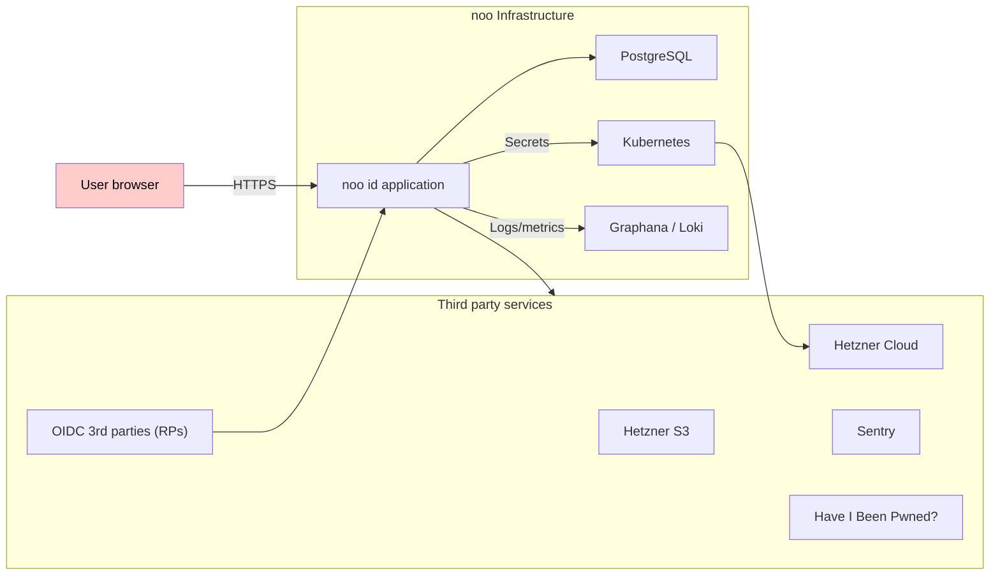

# Threat Model for noo id

**First version:** 2025-04-08

This document is an overview of the threat model for **noo id**, the central authentication and identity management service for the noo ecosystem.

## Introduction & scope

This threat model covers the **noo id** service, including its operation as:

- the entry point for user authentication and identity management within the noo ecosystem,
- a public OpenID Connect (OIDC) identity provider (IdP) for third-party relying parties (RPs), and
- a multi-tenant IdP for enterprises and government entities.
- a self-hosted IdP.

We identify threats using [STRIDE](https://en.wikipedia.org/wiki/STRIDE_model) against specific application flows and components.

Specifically for OIDC flows, the [OAuth 2.0 Threat Model and Security Considerations](https://datatracker.ietf.org/doc/html/rfc6819) is considered to be the primary reference.

## Application overview and architecture

**noo id** acts as the authentication and identity management service for the **noo** ecosystem. All noo applications and services rely on **noo id** for user authentication. It also serves as a public OpenID Connect (OIDC) provider for third-party applications, and a private Identity Provider for enterprises.

**noo id** is deployed on noo infrastructure, where it acts as a multi-tenant application (each enterprise is a separate tenant, alongside a public noo tenant). Enterprises can also deploy **noo id** on their own infrastructure, where it is expected to function as a single-tenant application.

For a detailed description of **noo id** please refer to its documentation.

**Key features:**
  - User registration (Sign up)
  - User authentication (Sign in - Password, Passkeys, TOTP)
  - Profile management
  - Session Management
  - OIDC Provider Endpoints (Authorization, Token, UserInfo, JWKS, Discovery, etc.)
  - (Private OP): Tenant, User/Group, Client, Policy Management

**Architecture summary:**
  - Monolithic service (node.js, react-router Framework, express)
  - PostgreSQL database
  - React frontend, server-side rendered
  - Deployed on Kubernetes as a docker image, hosted on Hetzner Cloud
  - External Dependencies:
    - Sentry for error tracking and monitoring
    - Have I Been Pwned API for password breach checks
    - Hetzner Object Storage (S3) for static assets storage, backups and user photos

## Key assets

This application is a central and critical component of the noo ecosystem. It handles sensitive and PII data and is a potential target for a various threats. It is likely to be the first target for any attack against the noo ecosystem.

The following is a list of the most important assets that we need to protect:

- User identities, like usernames, email addresses, passwords and TOTP secrets. We also store passkey public keys, but these are not a sensitive asset.
- User sessions data, including session tokens.
- A number of Personally Identifiable Information (PII) data, like names, surnames, addresses, IP addresses, user agents, profile picture. In the future, passport or ID card authentication data (specifics TBD).
- Pseudonymous identifiers: using unique email addresses generated for third party sign-ins.
- OIDC specific data, like client secrets, authorization codes, access and refresh tokens, JWK Sets.
- System secrets: database credentials, S3 keys, API tokens to third parties.

While not a concrete assets, the following are also critical:

- the reputation and trust of the noo ecosystem. A breach of **noo id** would be incredibly damaging.
- the availability and reliability of the service

## Security goals & priorities

Based on the assets and the nature of the service, our primary security goals are, in no particular order:

- **Confidentiality:** protect user credentials, PII, session data, OIDC secrets, and system secrets from unauthorized disclosure. Uphold user privacy commitments.
- **Integrity:** prevent unauthorized modification of user data, configurations, policies, and application code.
- **Availability:** the authentication service must be reliable and accessible to legitimate users when needed.
- **Business logic correctness:** the application behaves as expected in the most critical flows.

## Trust boundaries

At a high level, we can identify the following trust boundaries:

## Assumed threat actors

Given the application nature and features, we risk becoming a primary target for a variety of threat actors. The following list outlines the most relevant threat actors we need to consider:

* **Internet-wide vulnerability scanners:** these are automated tools that scan the internet for known vulnerabilities (CVEs) and misconfigurations. They can be used by both white-hat security researchers, as well as malicious actors.
* **Script kiddies:** individuals with limited technical skills, usually motivated by curiosity, notoriety or minor personal gain. They may use widely available tools to exploit known vulnerabilities.
* **Organized crime:** attempting theft of PII, identity fraud or the installation of resident malware for cryptocurrency mining, data exfiltration or ransomware.

### Infrastructure provider

While our infrastructure provider is a reputable company, we must acknowledge the potential risks associated with using any third-party cloud service. These include the possibility of insider threats or technical compromises at the provider level. These are not easy to mitigate, and we must rely on the provider's security controls and practices. We accept some residual risk, planning for enhanced security controls in the future.

### Nation state actors

The dual role nation-states might play as both customers and adversaries is a significant concern.

Legitimate government bodies and public administrations may utilize the noo ecosystem for various purposes, including collaboration, communication, cloud services and identity.

On the other hand, certain state actors may attempt malicious actions. Motivations could include:

- Targeting specific high-profile users (journalists, activists, political figures, employees of specific organizations) for surveillance or to disrupt their activities.
- Attempting mass data collection.
- Performing espionage or disruption against specific tenants (enterprises or other government entities using the service).
- Attempting to compel access to data or system capabilities through legal or extra-legal means.

We are committed to upholding user privacy and trust within the applicable legal frameworks (primarily EU jurisdiction). While we must comply with valid, lawful requests from legitimate authorities, we will:

- Rigorously scrutinize the legality and scope of any request.
- Challenge unlawful or overly broad demands through available legal means.
- Employ technical designs that minimize the data we hold (data minimization) and limit our ability to access user data where possible.
- Maintain transparency about government requests where legally permissible.

## Threat models by feature

* [01_authentication_flow.md](link_placeholder) - *(In Progress)*
* [02_registration_flow.md](link_placeholder) - *(TODO)*
* [03_profile_management.md](link_placeholder) - *(TODO)*
* [04_oidc_flows.md](link_placeholder) - *(TODO)*
* [05_tenant_admin_features.md](link_placeholder) - *(TODO)*
* [06_multi_session_management.md](link_placeholder) - *(TODO)*
* [07_policy_enforcement.md](link_placeholder) - *(TODO)*
